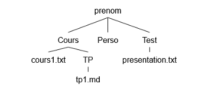
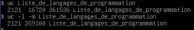

# TP1 - Prise en main de Linux
Par Mathieu MERLE - BTS SIO 1

## Exercice 1

Depuis le répertoire `/home/mathieu` j'ai créé l'arborescence  avec les commandes suivantes :

```bash
mkdir Cours
mkdir Test
mkdir Perso
cd Cours
mkdir 
```

L'arborescence obtenue est la suivante :



## Exercice 2

Pour modifier le contenu du fichier j'ai utilisé l'éditeur de texte du linux `nano` :

```bash
nano Test/presentation.txt
```

## Exercice 3

j'ai affiché le contenu de `presentation.txt` avec son chemin relatif :

```bash
cat Test/presentation.txt
```

## Exercice 4

J'ai utilisé `less` avec le chemin absolu :

```bash
less /home/mathieu/Test/presentation.txt
```

## Exercice 5

J'ai commencer par copié `presentation.txt` et le renomant `readme.txt` puis j'ai déplacé ce fichier dans le répertoire `Perso` :

```bash
cp presentation.txt readme.txt
mv readme.txt /home/mathieu/Perso
```

Le répertoire `Perso` contient maintenant `readme.txt`.

## Exercice 6

Pour supprimer le fichier j'ai utilisé la commande:

```bash
rm presentation.txt
```

## Exercice 7

Depuis `/home/mathieu` j'ai essayé de supprimer les deux répertoires :

```bash
rmdir Test
rmdir Cours
```

Le répertoire `Test` a été supprimé car il était vide mais la suppression de `Cours` a échoué car ce répertoire avait encore des fichiers et le dossier `TP`.

La commande `rmdir` ne supprime que les répertoires vides mais pour supprimer un répertoire avec des fichiers il faudrait utiliser `rm -r` :

```bash
rm -r Cours
```

## Exercice 8

Je me suis mis dans le répertoire `Perso`et  j'ai renommé le fichier avec `mv` :

```bash
mv readme.txt readme.md
```


## Exercice 9

J'ai récupéré la page Web avec `wget` :

```bash
wget https://fr.wikipedia.org/wiki/Liste_de_langages_de_programmation
```

Le fichier téléchargé s'appelle `Liste_de_langages_de_programmation` Et pour compter ses lignes et ses caractères, j'ai fait :

```bash
wc -l -m Liste_de_langages_de_programmation
```

Résultat de la recherche:



## Exercice 10

Pour afficher les lignes correspondan aux langages de programmation dans le fichier HTML j'ai utilisé la commande `grep`  :

```bash
grep '<li><a rel="mw:WikiLink" href=' Liste_de_langages_de_programmation
```